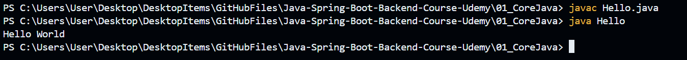
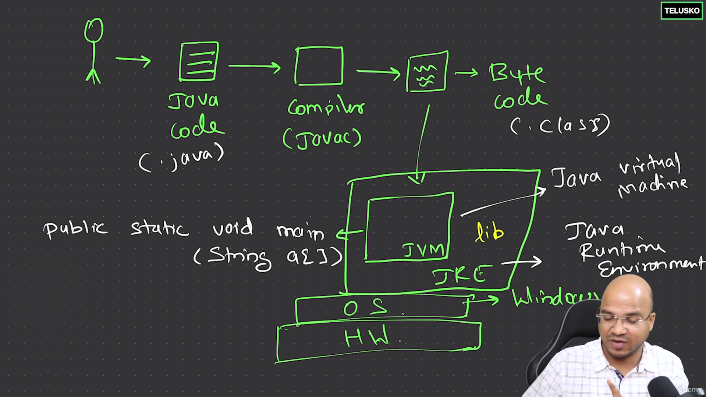
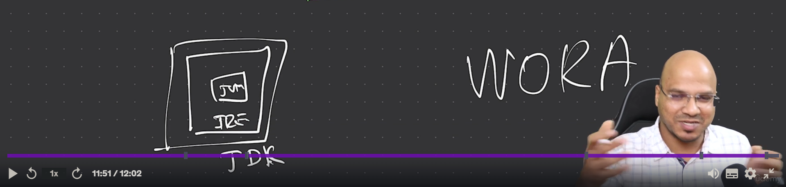

```java
class Hello //this must be same as the name of the file, and mind you this is also case sensitive
{
    public static void main(String args[])
    {
        System.out.println("Hello World");
    }
}
//to run the above code type in terminal

//javac filename.java -> to compile the java code
//java classname -> to run the code


```
]

```java
//as soon as you run the javac command and the code compiles a .class file is generated (this is the byte code)
// the below will give you the idea of how java programs runs behind the scene
//note we say that java is independent
// yess that is true
// java code can run run on any device which has JVM
// but JVM itself is platform dependent and it need to be built for specific OS

```



```java
// Java is a WORA language 
// this means Write Once Run Anywhere
// but what this actually means is that in order to develop an application you need to have JDK installed in your system
// but for someone to run the application you built you need to have just JRE and JVM

```